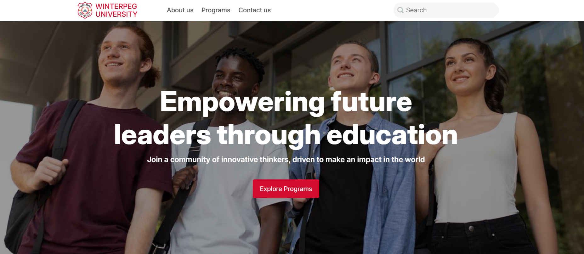
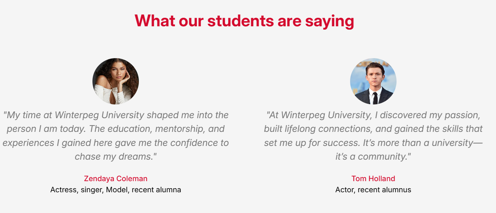

## Winterpeg University

This is the final project for Web Development SD-100 completed by Ashedzi Solomon, Haodi Hau and Sarah Mitchell. 

### Team Work
- Ashedzi did all the work for the header, footer and home page, including making all of those responsive. She was in charge of index.html and home.css   
 
- Sarah did the contact-us page as well as combining all of the files, and adjusting some of the class names for redundancy. She was in charge of contact.html, contact-style.css and general-style.css.   

- Haodi was in charge of the About us section, he wrote about.html and about-style.css although some changes were made to make it fit with the other pages.   

### Examples
Our examples were [Carleton University](https://carleton.ca/) and [Eduzone](https://html.ditsolution.net/eduzone/index.html)